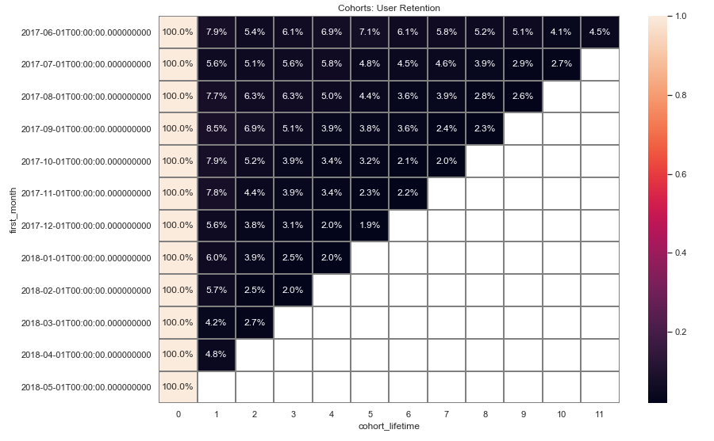
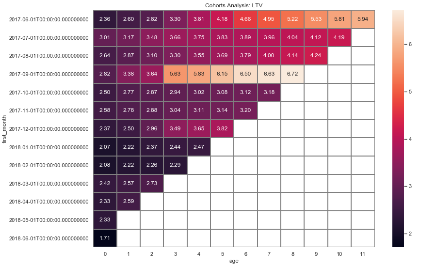
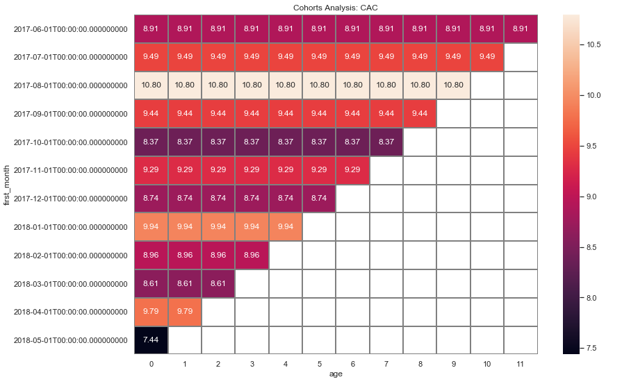
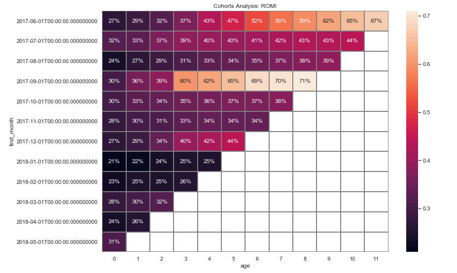
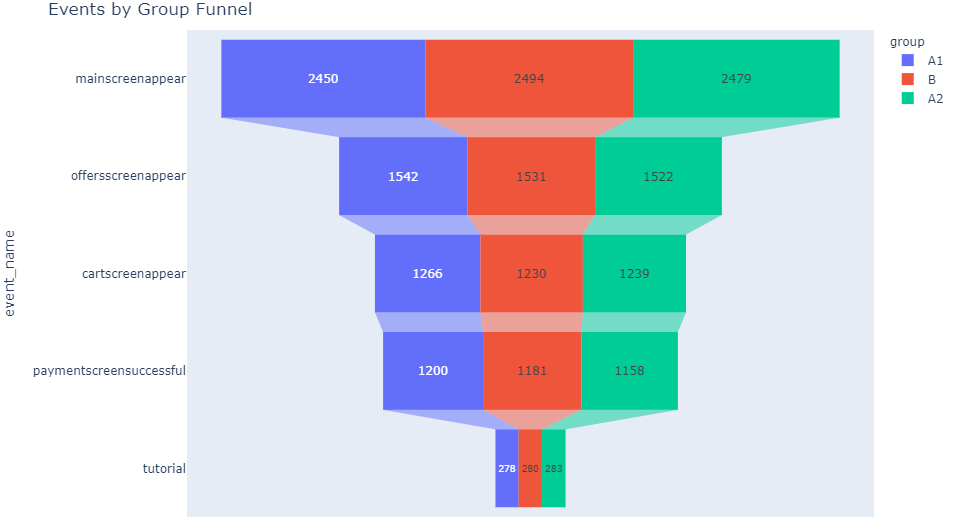

   
 

 
# Project: Business Review of Markets Across the World Economny

    

### [Project Link](https://public.tableau.com/app/profile/emmanuel.nti/viz/DashboardonBusinessReview/Dashboard1)
#### Software and Tools

# Project: Business Metrics of Yandex Afisha
 As a Junior Data Analyst in the analytical department at Yandex. I analyzed the business metrics of the Yandex Afisha app to help the marketing experts optimize marketing expenses.
 
### [Project Link](https://nbviewer.org/github/Emmanuel-Nti/Business-Metrics-of-Yandex-Afisha/blob/master/business_metrics_nti.ipynb) 

### Daily Visits to Yandex Afisha
Amazingly, 24 November, 2017 was a black friday; it had the highest number of visits to the Yandex Afesha app. 
March 31, 2018 was a popular holiday plus observances Worldwide; a holiday can adversely impact visits to Yandex Afisha but black friday stimulated visits.

   
 

 
###  User Retention by Cohort
The June 2017 cohort had the highest retention rate as at month 11. By the first month (month 1), all cohorts had retention rates less than 10%. 

   
 

 
 
### Lifetime Value (LTV) Cohort Analysis
The June 2017 cohort had the longest duration of LTV; contributed the longest time. However, the September 2017 cohort had the highest LTV. 
June 2018 cohort had the least LTV.

   
 

 
 
### Customer Acquisition Cost (CAC) Cohort Analysis
CAC per cohorts shows a uniform but different costs for each cohort.The August 2017 cohort had the highest cost in a given month while the May 2018 cohort had the least.

   
 

 
 
### Return on Marketing Investment (ROMI) Cohort Analysis
The September 2017 cohort had the highest return on investments, followed by the June 2017 cohort. 
May 2018 cohort had the lowest return on investments. No cohort has recouped 100% of invesments.

   
 

### General Findings
- On average, about 907 people use the Yandex Afisha app everyday, about 5621 people use it every week, and about 23228 people use it every month.
- The highest daily visits occur on a black friday and the lowest daily visits occur on a holiday
- On average, there is about 1 session per day, and each session lasts about 60 seconds.
- By the first month (month 1), all cohorts had retention rates less than 10%. None of the May 2018 cohort came back after their first visit. Only June 2017 cohort were retained till month 11.
- The December 2017 users made about 4400 orders (the highest), this is followed by October 2017, and November 2017. Users in the months June, July, and August have the least number of orders.
- On average, people start buying within 0 minutes (immediately), and the average purchase size is about 5.00 dollars.
- The June 2017 cohort contributed the longest time but the September 2017 cohort had the highest LTV. May and June 2018 cohorts had the least LTVs.
- CAC per month/cohorts shows a uniform but different costs for each cohort.The August 2017 cohort had the highest cost in a given month while the May 2018 cohort had the least.
- Users of platforms/source 1 and 2 bring in the highest revenue, and users of platform 7 bring in the least.
- Plaform 3 has the highest cost but it is amongst the least revenue generators.
- Platforms 1 and 2 brings in the highest revenue, and amongst the least in cost. They are the most profitable platforms.
- The investments in all the sources are not yet worthwhile as the highest (source 1) is yet to recoup 100% of investment. Also, investments by cohorts is not yet worthwhile.

### Recommendations
- Invest more in sources 1 and 2, and cut costs on plaform 3; without plaform 3, revenues would exceed cost.
- Introduce strategies to boost rentention rate; improve user experience with the app.

#### Software and Tools

# Project: A/A/B Test to Inform Business Decisions
Investigated user behavior for a company's app, and conducted an A/A/B test to assist managers to make an informed business decision.

### [Project Link](https://nbviewer.org/github/Emmanuel-Nti/aab_testing/blob/master/AAB_testing.ipynb)

### User Distribution by Group
All groups were present at all times for the test.
 

   
 

 
### User Behaviour
The funnel show stages of customers behaviour on the app. The group sizes at each stage indicate the data was splitted approximately equal.

   
 

 
### General Findings
- In preparing the data for analysis, missing values were checked, about 0.17% of duplicates were found in the data and deleted. 
- I ensured no participant belong to more than one group, and columns were converted to required data types.
- There were 7551 unique users in the logs, 5 types of events, and 243713 events in the logs.
- The data spanned a period of about two weeks. The minimum date was 2019-07-25 00:00:00, and the maximum date was 2019-08-07 00:00:00.
- The data was comparatively incomplete from 2019-07-25 to 2019-07-31. From 2019-08-01, the data was comparative complete. Hence, I chose to keep data from the period 2019-08-01 and ignored the earlier section, i.e. from 2019-07-25 to 2019-07-31.
- The event funnel was studied. Users initially visit the main screen, followed by an offer screen, then a cart screen is offered, and a payment is made. At the last stage, an optional tutorial is offered. Ignoring this order, and following the order based on how the data is sorted by the number of users and its' importance; the stage at with more users are lost, is from main screen stage to offer screen (about 38%).
- The share of users that make the entire journey from their first event to payment is about 47% (high conversion rate). This can be boosted by:
  - Conducting an A/B test for each event to reveal the stage of event where conversion of the service can significantly be enhanced.
  - Using a conversion rate optimization (CRO) planner, shortening forms, increasing trust and removing friction, and etc. For instance, conversion rate at the tutorial stage is not encouraging and should be considered for removal as it is contributing to a lower conversion.
- There is no statistically significant difference between groups A1 and A2 which implies the groups were splitted properly.
- There is also no statistically significant difference between groups A and B which implies the test was not successful.

### Recommendation
-  Stop the test, there is no difference between the groups. Hence, do not change the fonts for the entire app.

#### Software and Tools

# Project: Customer Churn Prediction and Retention Strategy
I predicted customer churn for achain of gyms and came out with retention strategies.

### [Project Link](https://nbviewer.org/github/Emmanuel-Nti/customer_churn_prediction_and_retention_strategy/blob/master/customer_churn_nti.ipynb)

### Cluster of Customers
Customers can be optimally classified into 5 clusters

   
 

 
### Churn Prediction 
Targeting the top 40% of the custmers, we would capture about 95% of clients who would churn.
 

   
 

 
### General Findings
- Total number of customers who live near the gym are 5 times more than customers who live far away. More than 50% of customers who do not stay closer to the gym churn while less than half of those who live closer to the gym churn.
- More than half of the customers are employees of a partner company. About 50% of non partner customers churn. Only about 20% of customers from partner companies churn.
- Customers whose joined the gym without promo friends are more than those who joined via promo friend. However, customers who join gym via promo friends are less likely to churn than those who join without a promo friend.
- Share of customers who signed 1 month contract are more than those who signed 6 and 12 months contract. No customer signed a three-month contract. More than 70% of customers who sign 1 month contract churn. less than 5% of customers who sign 12 months contract churn.
- Younger people are more likely to churn than older people.
- Old customers are less likely to churn than new customers.
- There are optimally 5 cluster of customers.
- Churn rates differ among clusters. Clusters 3 and 4 are more prone to leaving, clusters 1 and 2 are more loyal.
- Overall, churn rate is about 27%.
- About 95% of churners are captured in the top 40% of the custmers.

### Recommendations
- Optimally minimize customer churn with a promotion package targeting the top 40% of customers; this can boost customer retention up to about 95%.
- Encourage customers to sign 12 months contract to reduce churn rate.
- Pay much attention to customers in Clusters 3 and 4 as they are more prone to leaving.
- Introduce loyalty programs.

- #### Software and Tools

