### 🎯 Featured Focus Areas of my Projects
- **Customer Analytics & Retention:** Cohort analysis, churn prediction, and retention strategies.  
- **Experimentation & Testing:** A/A/B tests to guide product and business decisions.  
- **Business & Market Insights:** Dashboards, product range analysis, and predictive modeling to uncover patterns and opportunities.

Explore the projects below to see the analyses, insights, and solutions in action.

---

# 📌 Project: Customer Churn Prediction and Retention Strategy
As a Strategy Analyst for Gym, I predicted customer churn for the gym's chain and developed retention strategies.

## [Project Link](https://nbviewer.org/github/Emmanuel-Nti/customer_churn_prediction_and_retention_strategy/blob/master/customer_churn_nti.ipynb)

#### Cluster of Customers
Customers can be optimally classified into 5 clusters

   

#### Churn Prediction 
Targeting the top 40% of the customers, we would capture about 95% of clients who would churn.
 

   
 

 
#### 📊 General Findings
- Contract structure is the strongest driver of churn: short-term (1-month) members show very high churn (>70%), while long-term (12-month) contracts have near-full retention (<5% churn).
- Acquisition channels differ in quality: partner-company customers and referral-based signups have significantly lower churn, indicating higher-intent segments.
- Geographic proximity impacts retention, with customers living farther from the gym exhibiting materially higher churn.
- Churn is higher among newer and younger customers, pointing to gaps in early-stage engagement and onboarding.
- Churn is highly concentrated and predictable: ~95% of churners fall within the top 40% high-risk segment, with specific clusters driving most attrition.

#### 🎯 Recommendations
- Focus retention efforts on the top 40% high-risk segment using predictive targeting to maximize impact.
- Encourage migration to longer-term contracts through incentives or bundled offerings to reduce churn structurally.
- Rebalance acquisition toward partner and referral channels to improve customer quality and long-term retention.
- Strengthen early lifecycle engagement through onboarding and targeted interventions, particularly for newer and younger customers.
  
#### Software and Tools

# 📌 Project: A/A/B Test to Inform Business Decisions
Investigated user behavior for a company's app, and conducted an A/A/B test to assist managers to make an informed business decision.

## [Project Link](https://nbviewer.org/github/Emmanuel-Nti/aab_testing/blob/master/AAB_testing.ipynb)

#### User Distribution by Group
All groups were present at all times for the test.
 

   
 

 
#### User Behaviour
The funnel shows stages of customers' behavior on the app. The group sizes at each stage indicate the data was split approximately equally.

   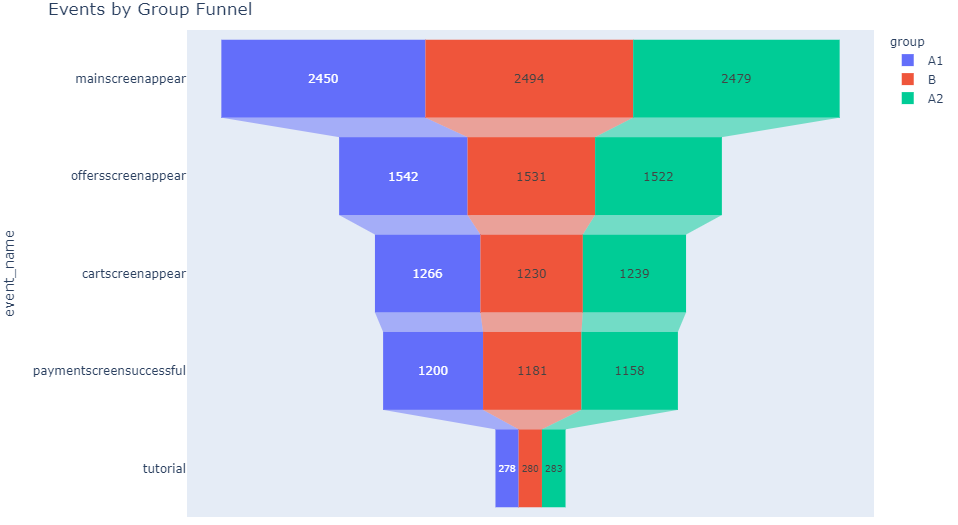
 

 
#### 📊 General Findings
- Data quality checks confirmed reliable experimentation: no cross-group contamination and consistent group distributions, validating the integrity of the A/A/B test setup.
- User funnel analysis shows the largest drop-off occurs early in the journey (main screen → offer stage, ~38%), indicating a key friction point in initial user engagement.
- End-to-end conversion is relatively strong (~47%), suggesting the core product experience is effective once users progress beyond the initial stages.
- Certain stages (e.g., tutorial) underperform and contribute negatively to conversion, highlighting potential unnecessary friction in the user journey.
- No statistically significant differences were observed between A1 and A2 (A/A test) or between A and B, indicating both correct test randomization and no measurable impact from the tested change.

#### 🎯 Recommendations
- Do not roll out the tested change, as it does not deliver a statistically significant improvement over the control.
- Prioritize optimization of early funnel stages (main screen → offer) where the largest user drop-off occurs.
- Simplify or remove low-performing steps (e.g., tutorial) to reduce friction and improve conversion.
- Implement targeted A/B tests at specific funnel stages to isolate and improve conversion bottlenecks.
#### Software and Tools

# 📌 Project: Business Review of Markets Across the World Economy

   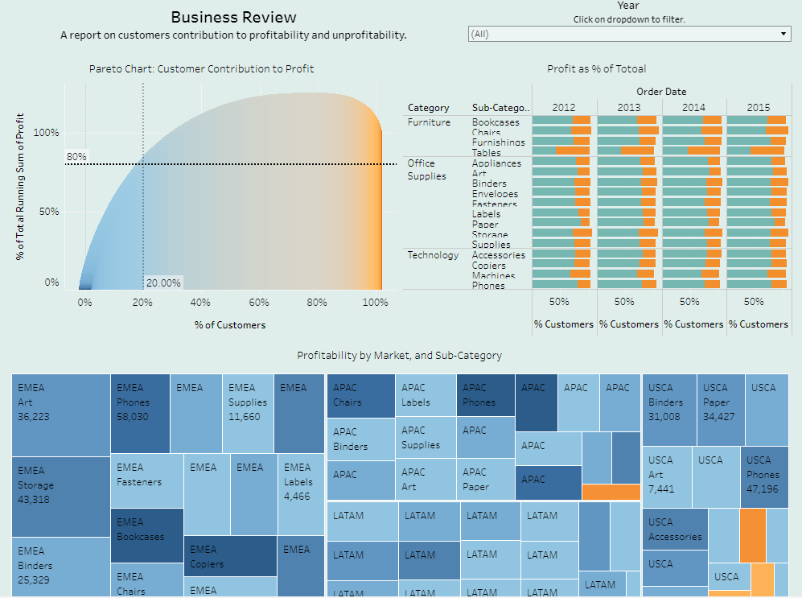 

## [Project Link](https://public.tableau.com/app/profile/emmanuel.nti/viz/DashboardonBusinessReview/Dashboard1)
#### Software and Tools

# 📌 Project: Business Metrics of Yandex Afisha
 As a Junior Data Analyst in the analytical department at Yandex. I analyzed the business metrics of the Yandex Afisha app to help the marketing experts optimize marketing expenses.
 
## [Project Link](https://nbviewer.org/github/Emmanuel-Nti/Business-Metrics-of-Yandex-Afisha/blob/master/cohorts_analysis.ipynb) 

#### Daily Visits to Yandex Afisha
The highest number of visits to the Yandex Afesha app was on Black Friday (24.11.2017). March 31, 2018, was a popular holiday plus observances Worldwide - a holiday can adversely impact visits to Yandex Afisha but black friday stimulated visits.

   
 

 
####  User Retention by Cohort
The June 2017 cohort had the highest retention rate as of month 11. By the first month (month 1), all cohorts had retention rates of less than 10%. 

   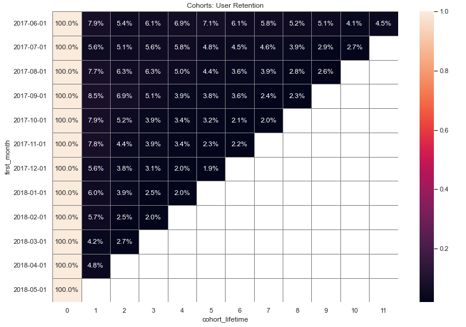
 

 
 
#### Lifetime Value (LTV) Cohort Analysis
The June 2017 cohort had the longest duration of LTV; contributed the longest time. However, the September 2017 cohort had the highest LTV. 
June 2018 cohort had the least LTV.

   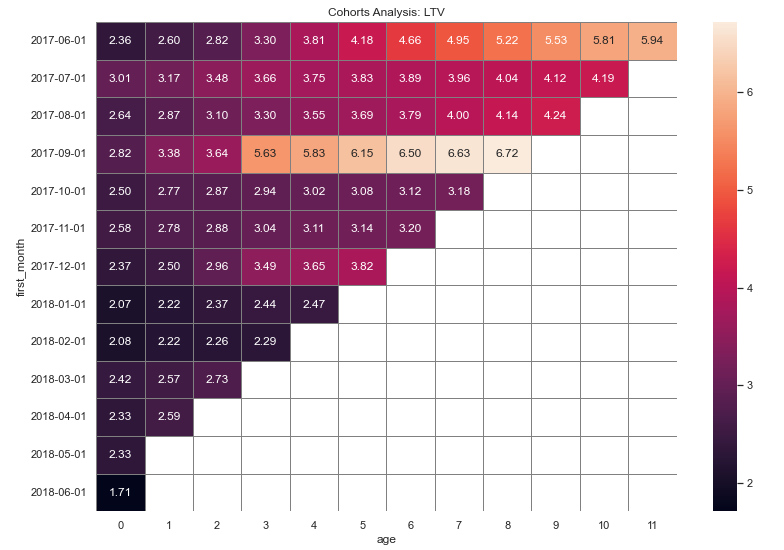
 

 
 
#### Customer Acquisition Cost (CAC) Cohort Analysis
CAC per cohort shows uniform but d for each cohort. The August 2017 cohort had the highest cost in a given month while the May 2018 cohort had the least.

   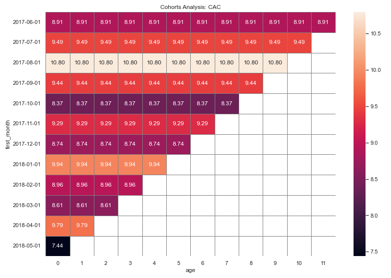
 

 
 
#### Return on Marketing Investment (ROMI) Cohort Analysis
The September 2017 cohort had the highest return on investments, followed by the June 2017 cohort. 
May 2018 cohort had the lowest return on investments. No cohort has recouped 100% of investments.

   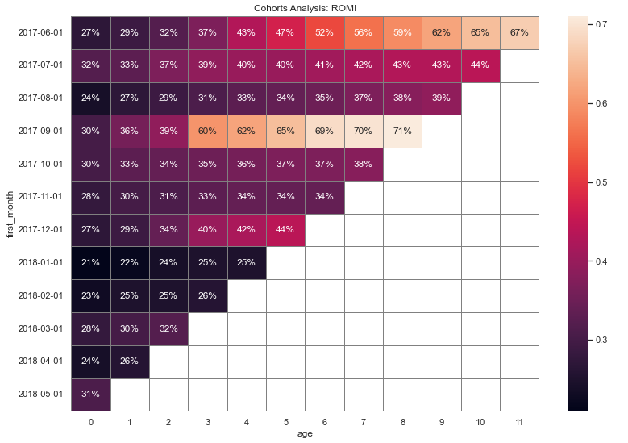
 

#### 📊 General Findings
- The app demonstrates a stable but modest user base (~23K MAU), with sharp traffic spikes driven by major commercial events (e.g., Black Friday), indicating high dependence on campaign-driven acquisition rather than consistent organic engagement.
- User engagement is shallow: sessions average ~1 per day and ~60 seconds, suggesting limited content interaction and low perceived value beyond initial entry points.
- Retention is critically low across all cohorts (<10% by month 1), with most users churning immediately after the first visit—highlighting a fundamental gap in product stickiness and lifecycle engagement.
- Revenue is concentrated in a few high-performing cohorts and acquisition sources, with strong seasonality (Q4 peaks), while summer cohorts underperform—indicating demand sensitivity to external factors and inconsistent user quality.
- Marketing efficiency is imbalanced: top-performing sources (1 & 2) deliver high revenue at relatively low cost, while others (notably source 3) show poor ROI; overall, no cohort has yet achieved full CAC payback, signaling unprofitable growth.

#### 🎯 Recommendations
- Reallocate marketing spend toward high-ROI channels (sources 1 & 2) and systematically reduce or pause underperforming channels (e.g., source 3) until efficiency improves.
- Address retention as the primary growth constraint by introducing lifecycle interventions (onboarding optimization, personalized recommendations, and re-engagement campaigns) to improve post-first-visit return rates.
- Increase user engagement depth by enhancing in-app discovery and content value (e.g., event recommendations, reminders, or curated experiences) to extend session duration and frequency.
- Shift performance measurement toward unit economics by tracking cohort-level CAC payback and LTV/CAC ratios, and using these to guide budget allocation and scaling decisions.

#### Software and Tools

# 📌 Project: Product Range Analysis
As a junior analyst at an online store that sells household goods, I analyzed the store's product range for the period 29/11/2018 to 07/12/2019.
## [Project Link](https://nbviewer.org/github/Emmanuel-Nti/Product-Range-Analysis/blob/master/product_range_capstone.ipynb) 
#### Product Categorization Model
A near-perfect model was built to categorize the products.

   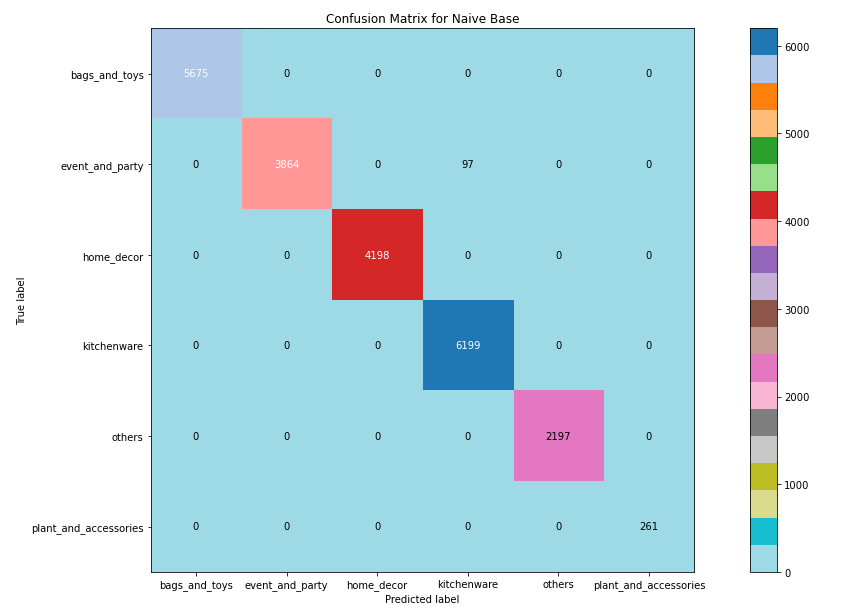
 

#### Products in Additional Assortment
About 99% of the products were sold together with others.

   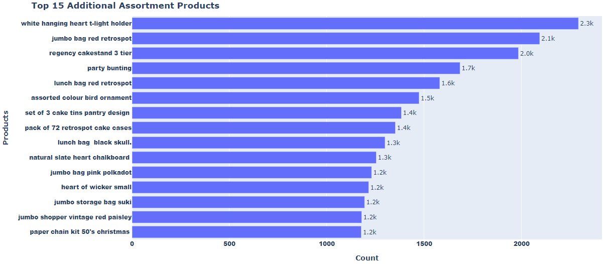
 

#### 📊 General Findings
- Product prices vary widely, with the highest at £38,970.00 and an average unit price of ~£4.60, reflecting a mix of high-value and low-cost items in the catalog.
- Large-volume orders are driven by wholesalers, evidenced by invoice 573585 containing 1,113 products; the top ten invoices confirm the store’s dependence on bulk buyers.
- Kitchenware is the most frequently purchased category, while plant and accessories are the least, highlighting strong category-level demand disparities.
- Total monthly orders increased by ~121% from December 2018 to November 2019, with revenues higher from August to November, reflecting clear seasonal effects.
- Regency Cakestand 3 tier and paper craft little birdie are the top revenue-generating products (£174,200 and £168,469 respectively), while home decorations generates the highest average revenue (~£23 per unit).
- A vast majority of products (99.7%) are purchased as part of additional assortments, highlighting strong cross-selling opportunities and customer interest in complementary products.
- Certain product pairings dominate additional assortments (e.g., Jumbo bag and pink polka dot with Jumbo bag red retro spot), with Kitchenware most frequently included (~152,610 times).

#### 🎯 Recommendations
- Implement a product recommendation system leveraging co-purchase patterns (99.7% of products sold with others) to increase basket size and cross-sell effectiveness.
- Increase marketing investment in home decorations, which has high revenue per unit despite moderate purchase frequency, to maximize revenue impact.
- Expand advertising for plant and accessories to increase order frequency and diversify revenue sources across categories.
- Investigate the high cancellation rate for Regency Cakestand 3 tier (180 cancellations) and implement measures to reduce cancellations, as minimizing this would significantly improve revenue.
  
#### Software and Tools

  

# 📌 Project: A/B Test for an International Online Store
I have received an analytical task from an international online store. I have to launch an A/B test and give insights into changes related to the introduction of an improved recommendation system.
## [Project Link](https://nbviewer.org/github/Emmanuel-Nti/ab_test_for_an_international_online_store/blob/master/ab_test_for_international_store.ipynb)
 
#### Customer Journey

   
 

 
#### Revenue From Each Group
Cumulative revenue from Group A exceeds Group B
 

   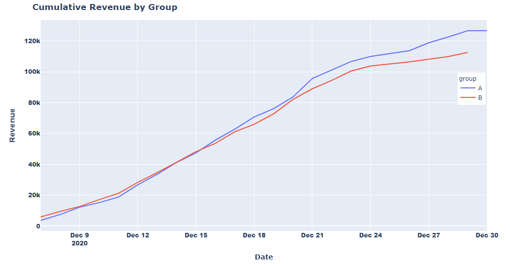
 

 
#### 📊 General Findings
- The test sample was dominated by EU participants, representing ~23% of new users on or before 21st December 2020, ensuring the results primarily reflect EU customer behavior.
- User behavior shows clear drop-offs: ~66% of users proceed from login to product page, and only ~50% of those proceed to purchase, while ~15% purchase without adding items to the cart.
- Overall conversion rate across the test is ~33.3%.
- The maximum order value is ~$500, the minimum ~$5, with a mean of ~$23.88 (SD ~72.22), indicating a wide variance in purchase sizes.
- A statistically significant difference was observed between groups A and B, confirming that the test was correctly randomized and capable of detecting differences.

#### 🎯 Recommendations
- Group A outperforms Group B in both the number of customers and revenue generated.
- Introducing the improved recommendation system is expected to reduce purchases; therefore, do not implement the change in the current form.

#### Software and Tools

  

# 📌 Project: Predicting Credit Card Approvals
Built an automatic credit card approval predictor using machine learning techniques.
 
## [Project Link](https://nbviewer.org/github/Emmanuel-Nti/credit_cards_approvals_prediction/blob/master/Predicting_credit_cards.ipynb)

#### Decile Analysis
The decile analysis shows that the top 10% of customers have about an 80% probability that their credit cards would be approved.
Customers in deciles 1-6 have more than a 50% chance that their credit cards would be approved. 
Customers in deciles 7-10 have less than a 50 % chance of getting their credit cards approved.

   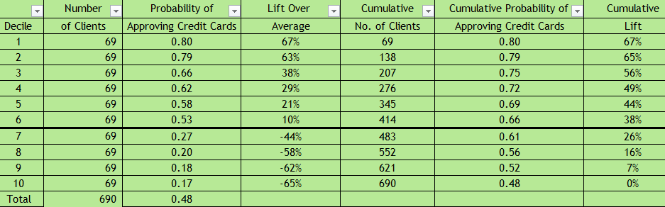
 

 
#### 📊 General Findings
- Over 50% of credit card applications are approved, with approval likelihood strongly correlated with debt size: smaller debt increases approval probability.
- Applicants are predominantly aged 20–40, who also have the highest approval rates; applicants over 60 are the least likely to apply and have the lowest approval probability.
- Male applicants submit more applications than females, reflecting demographic differences in credit card demand.
- The predictive model achieves ~88% accuracy, with the top 10% of customers having ~80% probability of approval.
- Deciles 1–6 of applicants have more than a 50% chance of approval, while deciles 7–10 have less than a 50% chance.

#### 🎯 Recommendations
- Approve credit card applications for customers in deciles 1–6 to maximize acceptance rates and minimize risk.
- Do not approve applications for customers in deciles 7–10, as their likelihood of approval is low and risk is higher.

#### Software and Tools

 

# 📌 Project: Video Games Sales Analysis 
I analyzed video game sales data to identify patterns that determine whether a game succeeds or not.
## [Project Link](https://nbviewer.org/github/Emmanuel-Nti/video_games_sales_analysis/blob/master/Video_Games_Sales_Analysis_Nti.ipynb) 

#### Number of Games Released in a Year
The number of games released in a year peaked in 2008 and significantly started falling in 2010.

   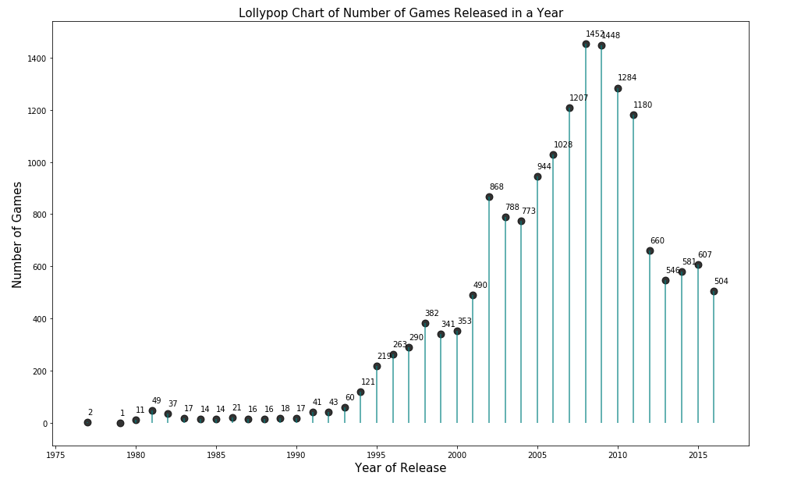
 

#### Profitable and Non-profitable Platforms.
The PS2 platform is the most profitable platform, the PCFX platform is the least non-profitable platform.

   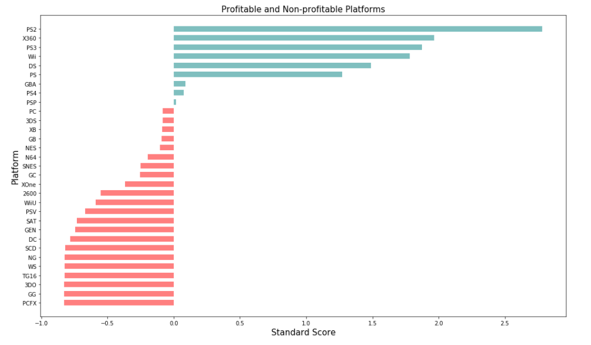
 

 
#### 📊 General Findings
- Video game releases grew significantly after 1994, with over 100 games released annually from 1994 to 2016, reflecting industry expansion and platform diversification.
- PS3 and X360 dominate overall sales since 2010, particularly in Europe and North America, while Nintendo 3DS and PS3 lead in Japan.
- New platforms generally appear within a year, while older platforms take ~8 years to fade; Atari 2600 had the longest lifecycle (35 years), illustrating long-term platform longevity potential.
- Action and Shooter genres drive the majority of sales globally, with Action consistently among the top two genres across Europe, North America, and Japan; Puzzle is the least profitable genre.
- Average sales per game are below $1 million across platforms; highest averages are on PS4 (about $0.8M) and lowest on GBA (~$0.05M), while positive correlation exists between user/platform reviews and game sales.
- ESRB ratings influence sales across regions, suggesting regulatory and content suitability impact consumer purchase behavior.

#### 🎯 Recommendations
- Focus development and marketing on high-performing platforms (PS3, X360, PS4, 3DS) in their respective dominant regions to maximize sales potential.
- Prioritize Action and Shooter genres for new releases, while minimizing investment in low-performing genres like Puzzle.
- Leverage user reviews and platform ratings as key inputs for sales forecasting and marketing prioritization.
- Consider ESRB ratings strategically in content design and marketing to optimize regional sales performance.
#### Software and Tools

  
