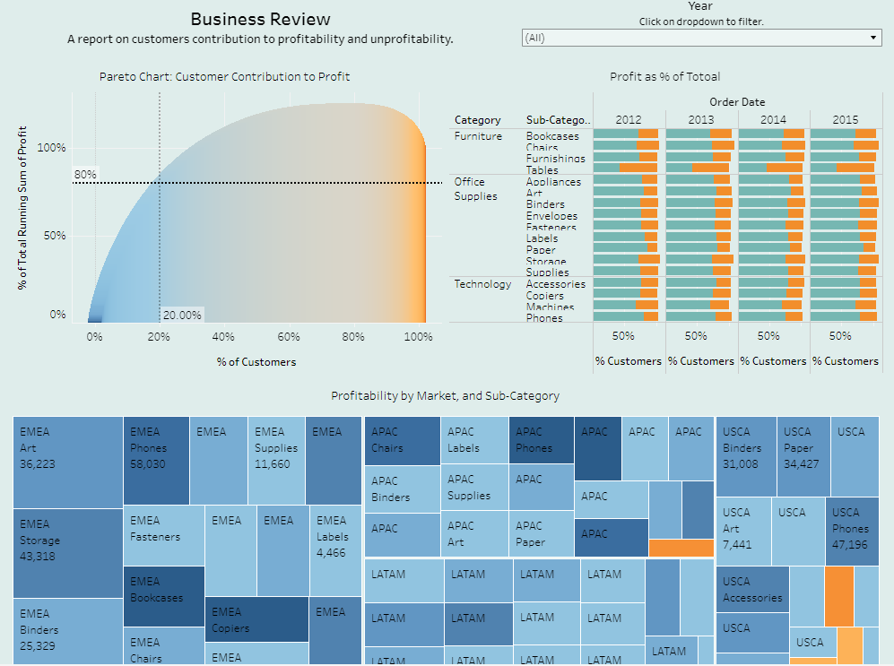

   
 

 
# Project: Business Review of Markets Across the World Economy

    

## [Project Link](https://public.tableau.com/app/profile/emmanuel.nti/viz/DashboardonBusinessReview/Dashboard1)
#### Software and Tools

# Project: Business Metrics of Yandex Afisha
 As a Junior Data Analyst in the analytical department at Yandex. I analyzed the business metrics of the Yandex Afisha app to help the marketing experts optimize marketing expenses.
 
## [Project Link](https://nbviewer.org/github/Emmanuel-Nti/Business-Metrics-of-Yandex-Afisha/blob/master/cohorts_analysis.ipynb) 

#### Daily Visits to Yandex Afisha
The highest number of visits to the Yandex Afesha app was on Black Friday (24.11.2017). March 31, 2018, was a popular holiday plus observances Worldwide - a holiday can adversely impact visits to Yandex Afisha but black friday stimulated visits.

   
 

 
####  User Retention by Cohort
The June 2017 cohort had the highest retention rate as of month 11. By the first month (month 1), all cohorts had retention rates of less than 10%. 

   
 

 
 
#### Lifetime Value (LTV) Cohort Analysis
The June 2017 cohort had the longest duration of LTV; contributed the longest time. However, the September 2017 cohort had the highest LTV. 
June 2018 cohort had the least LTV.

   
 

 
 
#### Customer Acquisition Cost (CAC) Cohort Analysis
CAC per cohort shows uniform but d for each cohort. The August 2017 cohort had the highest cost in a given month while the May 2018 cohort had the least.

   
 

 
 
#### Return on Marketing Investment (ROMI) Cohort Analysis
The September 2017 cohort had the highest return on investments, followed by the June 2017 cohort. 
May 2018 cohort had the lowest return on investments. No cohort has recouped 100% of investments.

   
 

#### General Findings
- On average, about 907 people use the Yandex Afisha app every day, about 5621 people use it every week, and about 23228 people use it every month.
- The highest daily visits occur on a Black Friday and the lowest daily visits occur on a holiday
- On average, there is about 1 session per day, and each session lasts about 60 seconds.
- By the first month (month 1), all cohorts had retention rates of less than 10%. None of the May 2018 cohort came back after their first visit. Only June 2017 cohort was retained till month 11.
- The December 2017 users made about 4400 orders (the highest), this is followed by October 2017, and November 2017. Users in the months of June, July, and August have the least number of orders.
- On average, people start buying within 0 minutes (immediately), and the average purchase size is about 5.00 dollars.
- The June 2017 cohort contributed the longest time but the September 2017 cohort had the highest LTV. May and June 2018 cohorts had the least LTVs.
- CAC per month/cohorts shows uniform but different costs for each cohort. The August 2017 cohort had the highest cost in a given month while the May 2018 cohort had the least.
- Users of platforms/source 1 and 2 bring in the highest revenue, and users of platform 7 bring in the least.
- Platform 3 has the highest cost but it is amongst the least revenue generators.
- Platforms 1 and 2 bring in the highest revenue, and amongst the least in cost. They are the most profitable platforms.
- The investments in all the sources are not yet worthwhile as the highest (source 1) is yet to recoup 100% of the investment. Also, investments by cohorts are not yet worthwhile.

#### Recommendations
- Invest more in sources 1 and 2, and cut costs on platform 3; without platform 3, revenues would exceed cost.
- Introduce strategies to boost retention rate; improve user experience with the app.

#### Software and Tools

# Project: Product Range Analysis
As a junior analyst at an online store that sells household goods, I analyzed the store's product range for the period 29/11/2018 to 07/12/2019.
## [Project Link](https://nbviewer.org/github/Emmanuel-Nti/Product-Range-Analysis/blob/master/product_range_capstone.ipynb) 
#### Product Categorization Model
A near-perfect model was built to categorize the products.

   
 

#### Products in Additional Assortment
About 99% of the products were sold together with others.

   
 

#### General Findings
- The highest unit price of a product cost £38,970.00.
- The unit price had a mean of about £4.60.
- Invoice number 573585 had the highest number of products ordered (1113 products). The top ten invoices show the customers of the store are mostly wholesalers.
- Kitchenware is the most frequently purchased category, and plant and accessories are the least frequently purchased category.
- The highest daily orders were on November 30th, 2018, followed by November 15th, 2019 (141 and 136 orders respectively). The lowest daily order was on 4th February 2019 - just 11 orders.
- The number of total monthly orders from December 2018 to November 2019 increased by about 121%.
- Revenues are comparatively lower from January to July and higher from August to November.
- Regency Cakestand 3 tier and paper craft little birdie are the top two products in terms of revenue generation. Regency Cakestand 3 tier generated revenue amounting to about £174,200.00 - the highest.
- The most canceled product order is Regency Cakestand 3 tier - canceled 180 times.
- On average, paper craft little birdie generated the highest revenue - about £168,469.00.
- On average, Kitchen ware generated the least revenue - about £18 while home decorations generated the highest- about £23.
- There were 1501 products that were sold by themselves. The rabbit night light was sold alone 32 times- the most sold alone product.
- About 99.7% of the products were sold together with others - additional assortment.
- Jumbo bag and pink polka dot and jumbo bag red retro spot were the products most often sold together.
- White hanging heart t-light holder was the product sold the most with others - about 2300 times. Kitchenware was most often included in additional assortment (about 152,610 times) and plant and accessories were the least - about 15,840 times.
- Event and party category was mostly present in shopping carts with Kitchenware.
- The difference between average revenue from home decorations and Kitchenware was statistically significant.
- The average revenue generated by papercraft little birdie is not statistically and significantly different from the average revenue from all other products.

#### Recommendations
- Since about 99.7% of products are included in the additional assortment, there is a need to create a product recommendation system.
- Home decorations is the third most purchased category but has the highest average revenue. Hence, invest more in advertising home decorations to boost purchase rates and revenue.
- As plant and accessories are the least frequently purchased category, increase advertising investment to enhance orders.
- Regency Cakestand 3 tier is the leading revenue generator on aggregate but the most canceled product order. Pay much attention to this product. For instance, why does it often get canceled? If the cancellation rate is minimized, revenue would be maximized.

#### Software and Tools

  

# Project: A/A/B Test to Inform Business Decisions
Investigated user behavior for a company's app, and conducted an A/A/B test to assist managers to make an informed business decision.

## [Project Link](https://nbviewer.org/github/Emmanuel-Nti/aab_testing/blob/master/AAB_testing.ipynb)

#### User Distribution by Group
All groups were present at all times for the test.
 

   
 

 
#### User Behaviour
The funnel shows stages of customers' behavior on the app. The group sizes at each stage indicate the data was split approximately equally.

   
 

 
#### General Findings
- In preparing the data for analysis, missing values were checked, and about 0.17% of duplicates were found in the data and deleted. 
- I ensured no participant belong to more than one group, and columns were converted to the required data types.
- There were 7551 unique users in the logs, 5 types of events, and 243713 events in the logs.
- The data spanned a period of about two weeks. The minimum date was 2019-07-25 00:00:00, and the maximum date was 2019-08-07 00:00:00.
- The data was comparatively incomplete from 2019-07-25 to 2019-07-31. From 2019-08-01, the data was comparatively complete. Hence, I chose to keep data from the period 2019-08-01 and ignored the earlier section, i.e. from 2019-07-25 to 2019-07-31.
- The event funnel was studied. Users initially visit the main screen, followed by an offer screen, then a cart screen is offered, and payment is made. At the last stage, an optional tutorial is provided. Ignoring this order, and following the order based on how the data is sorted by the number of users and its' importance; the stage with the most users is lost, which is from the main screen stage to the offer screen (about 38%).
- The share of users that make the entire journey from their first event to payment is about 47% (high conversion rate). This can be boosted by:
  - Conducting an A/B test for each event to reveal the stage of the event where conversion of the service can significantly be enhanced.
  - Using a conversion rate optimization (CRO) planner, shortening forms, increasing trust and removing friction, etc. For instance, the conversion rate at the tutorial stage is not encouraging and should be considered for removal as it is contributing to a lower conversion.
- There is no statistically significant difference between groups A1 and A2 which implies the groups were split properly.
- There is also no statistically significant difference between groups A and B which implies the test was not successful.

#### Recommendation
-  Stop the test, there is no difference between the groups. Hence, do not change the fonts for the entire app.

#### Software and Tools

# Project: Customer Churn Prediction and Retention Strategy
I predicted customer churn for a gyms chain and developed retention strategies.

## [Project Link](https://nbviewer.org/github/Emmanuel-Nti/customer_churn_prediction_and_retention_strategy/blob/master/customer_churn_nti.ipynb)

#### Cluster of Customers
Customers can be optimally classified into 5 clusters

   
 

 
#### Churn Prediction 
Targeting the top 40% of the customers, we would capture about 95% of clients who would churn.
 

   
 

 
#### General Findings
- The total number of customers who live near the gym is 5 times more than customers who live far away. More than 50% of customers who do not stay closer to the gym churn while less than half of those who live closer to the gym churn.
- More than half of the customers are employees of a partner company. About 50% of non-partner customers churn. Only about 20% of customers from partner companies churn.
- Customers who joined the gym without promo friends are more than those who joined via promo friends. However, customers who join the gym via promo friends are less likely to churn than those who join without a promo friend.
- Share of customers who signed a 1-month contract is more than those who signed 6 and 12 months contracts. No customer signed a three-month contract. More than 70% of customers who sign a 1-month contract churn. less than 5% of customers who sign 12 months contract churn.
- Younger people are more likely to churn than older people.
- Old customers are less likely to churn than new customers.
- There are optimally 5 clusters of customers.
- Churn rates differ among clusters. Clusters 3 and 4 are more prone to leaving, and clusters 1 and 2 are more loyal.
- Overall, the churn rate is about 27%.
- About 95% of churners are captured in the top 40% of the customers.

#### Recommendations
- Optimally minimize customer churn with a promotion package targeting the top 40% of customers; this can boost customer retention up to about 95%.
- Encourage customers to sign 12 monthly contracts to reduce churn rate.
- Pay much attention to customers in Clusters 3 and 4 as they are more prone to leaving.
- Introduce loyalty programs.

#### Software and Tools

# Project: A/B Test for an International Online Store
I have received an analytical task from an international online store. I have to launch an A/B test and give insights into changes related to the introduction of an improved recommendation system.
## [Project Link](https://nbviewer.org/github/Emmanuel-Nti/ab_test_for_an_international_online_store/blob/master/ab_test_for_international_store.ipynb)
 
#### Customer Journey

   
 

 
#### Revenue From Each Group
Cumulative revenue from Group A exceeds Group B
 

   
 

 
#### General Findings
- EU participants dominated all other regions in the sample.
- The maximum order total for purchase events is about $500.00, and the minimum is about $5.00, with a mean of about $23.88 and a standard deviation of about 72.22.
- About 66% of users proceed from login to the product page; about 50% of those at the product page proceed to purchase.
- About 15% of customers proceed to purchase without putting the product in the cart.
- About 33.33% of users convert.
- In the initial test by my predecessor, 441 users belonged to both groups, and 446 users participated in both tests.
- The highest number of events occurred on the 21st of December 2020 (14044 events).
- 8961 participants; representing about 23% of the new users on or before 21st December 2020, from the EU region were used for the test.
- There is a statistically significant difference between groups A and B which implies the test was successful.

#### Recommendations
- Stop the test, there is a significant difference between the groups. However, group A significantly exceeds Group B in number of customers and revenue. 
- Thus, there will be a reduction in purchases with the introduction of the improved recommendation system; do not introduce the recommendation system.

#### Software and Tools

  

# Project: Predicting Credit Card Approvals
Built an automatic credit card approval predictor using machine learning techniques.
 
## [Project Link](https://nbviewer.org/github/Emmanuel-Nti/credit_cards_approvals_prediction/blob/master/Predicting_credit_cards.ipynb)

#### Decile Analysis
The decile analysis shows that the top 10% of customers have about an 80% probability that their credit cards would be approved.
Customers in deciles 1-6 have more than a 50% chance that their credit cards would be approved. 
Customers in deciles 7-10 have less than a 50 % chance of getting their credit cards approved.

   
 

 
#### General Findings
- More than 50% of credit card applications get approved.
- Males apply for credit cards more than females.
- Most credit card applicants are between the ages of 20 and 40. This age group also has more credit card approvals than the other age groups.
- Applicants aged above 60 years are the least to apply for credit cards and the ones who are less likely to have their credit cards approved.
- The smaller a customer's debt, the higher the chances of a credit card approval.
- The model has about 88% accuracy in predicting credit card approval. 
- Top 10% of customers have about 80% probability that their credit cards would be approved.
- Customers in deciles 1-6 have more than a 50% chance that their credit cards would be approved.
- Customers in deciles 7-10 have less than a 50 % chance of getting their credit cards approved.

#### Recommendations
- Approve credit cards of customers in deciles 1-6.
- Do not approve the credit cards of customers in deciles 7-10.

#### Software and Tools

 

# Project: Video Games Sales Analysis 
I analyzed video game sales data to identify patterns that determine whether a game succeeds or not.
## [Project Link](https://nbviewer.org/github/Emmanuel-Nti/video_games_sales_analysis/blob/master/Video_Games_Sales_Analysis_Nti.ipynb) 

#### Number of Games Released in a Year
The number of games released in a year peaked in 2008 and significantly started falling in 2010.

   
 

#### Profitable and Non-profitable Platforms.
The PS2 platform is the most profitable platform, the PCFX platform is the least non-profitable platform.

   
 

 
#### General Findings
- Before 1994, there was no year that more than 100 games were released. However, from 1994 to 2016, more than 100 games have been released every year.
- PS, PS2, and Nintendo DS used to be popular platforms but now have zero sales.
- Generally, it takes about a year or less for new platforms to appear. On average, old platforms take about 8 years to fade.
- Atari 2600 platform existed for the longest number of years (35 years)
- Since 2010, the most profitable platforms are PS3, 3DS, DS, PC, PS4, Wii, X360, and XOne. In sum total, PS3 and X360 are leading in sales.
- In 2016, all platforms had experienced their peak sales and started shrinking, but PS4, XOne, and 3DS were leading in sales.
- Since 2010, average sales on various platforms differed but not significantly different especially among the highest performing platforms as average sales were all below $1 million. PS4 had the highest average sales of about $0.80 million, and the GBA platform had about $0.05 million in sales (the lowest).
- There is a positive correlation between reviews of platforms and the sale of games.
- Generally, since 2010, Action genres have been the most profitable considering the sum of total yearly sales. However, on average, the most profitable genre is Shooter. The least profitable game genre is Puzzle.
- PS3 and X360 platforms dominate sales in Europe and North American markets.
- Nintendo 3DS and PS3 dominate market share in Japan.
- The PS3 platform is at least among the top two dominant market shares of games across Europe, North America, and Japan.
- Action and Shooter genres are dominating the market share of sales in Europe and North America while Role Playing and Action dominate in Japan.
- Action genre is at least among the top two dominating genres across the three regions.
- ESRB ratings affect sales in individual regions.
- Average user ratings of the Xbox One and PC platforms are the same.
- Average user ratings for the Action and Sports genres are different.

#### Software and Tools

  
